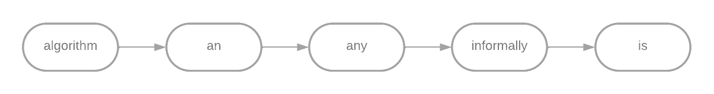
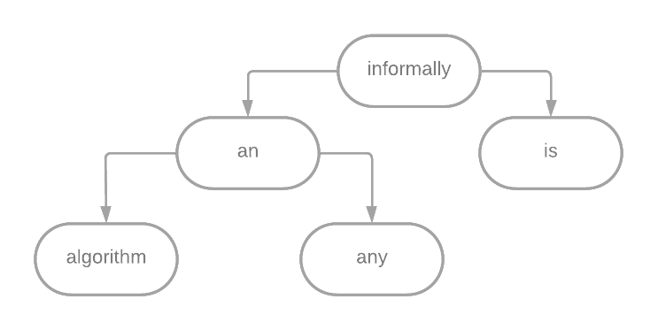

# Indexador de Palavras
O objetivo do código implementado é indexar as palavras de um texto em
ordem alfabética, inicialmente em uma lista ligada com cabeça (estrutura
relativamente simples), e posteriormente em uma árvore de busca binária
(estrutura mais complexa) para que possa ser realizada uma comparação entre
o tempo necessário para indexar e consultar palavras usando cada estrutura.

## Stack utilizada


## Rodando localmente

Clone o projeto

```bash
  git clone https://github.com/Caique27/Indexador-de-Palavras.git
```

Entre no diretório do projeto

```bash
  cd Indexador-de-Palavras
```

Compile o arquivo

```bash
  gcc ep.c -o ep
```

Execute o programa passando como parâmetro o arquivo de texto a ser lido e a estrutura a ser usada(lista ou arvore)

```bash
  ./ep texto.txt lista
```

## Estruturas Utilizadas
A lista ligada simplesmente ordena os elementos em ordem alfabética.
Considerando o texto de entrada: “Informally, an algorithm is any”, o algoritmo
criará o seguinte índice:



Já
na árvore
binária, o
algoritmo posiciona cada palavra a ser inserida no ramo direito do nó inicial caso
a palavra seja alfabeticamente posterior a palavra do nó ou a posiciona no ramo
esquerdo caso seja alfabeticamente anterior. O processo se repete até que se
que chegue a um ramo terminal da árvore. Neste momento a nova palavra é
adicionada e se torna um novo nó da estrutura.
Considerando a mesma entrada do exemplo anterior, obtemos a seguinte
estrutura:

Note que a ordem em que as palavras aparecem na entrada afetam a estrutura,
diferentemente da lista ligada.
## Analisando caso com entrada pequena
Primeiro analisaremos o tempo gasto por cada estrutura para indexar e buscar uma palavra em um texto curto. Usaremos um trecho do primeiro capítulo do livro Introduction to Algorithms(Cormen et al,2009):


*“Informally, an algorithm is any well-defined computational procedure that takes some value, or
set of values, as input and produces some value, or set of values, as output. An algorithm is thus
a sequence of computational steps that transform the input into the output. We can also view an
algorithm as a tool for solving a well-specified computational problem. The statement of the
problem specifies in general terms the desired input/output relationship. The algorithm describes
a specific computational procedure for achieving that input/output relationship. For example, we
might need to sort a sequence of numbers into nondecreasing order. This problem arises
frequently in practice and provides fertile ground for introducing many standard design
techniques and analysis tools.”*

|  Estrutura/Operação| `Indexar Palavras`     | `Buscar`                                           |
| :-------- | :------- | :------------------------------------------------- |
| `Lista Ligada`    | 0.235ms|0.057ms |
| `Árvore Binária`    | 0.241ms|0.053ms |


Neste caso a lista ligada foi ligeiramente mais rápida para construir o índice e
ligeiramente mais lenta para buscar a palavra. Porém, os resultados são
pouco conclusivos, já que a diferença de tempo é relativamente pequena.

## Caso com entrada grande
Agora, faremos a mesma análise utilizando um trecho mais longo de texto
gerado por uma IA, cujo trecho inicial pode ser lido a seguir:

*“Lorem ipsum dolor sit amet, consectetur adipiscing elit. Sed ornare nisi sit amet purus aliquam,
quis dignissim quam feugiat. Aenean libero ligula, sollicitudin at placerat vitae, porta id lacus.
Aliquam ut mi eget purus laoreet vestibulum sed dignissim dolor. Etiam aliquet sem libero, nec
aliquam velit efficitur consectetur. Duis ac neque risus. Nullam efficitur est sit amet justo varius
ultricies. Nunc tempor nisl non nisl egestas posuere ac at justo. Curabitur pretium elementum
interdum.
Vivamus consequat velit et lectus vestibulum mollis. Nulla hendrerit in velit et convallis. Mauris
eget metus at metus rhoncus suscipit et sit amet arcu. Sed consequat, nisl sed convallis congue,
justo sem varius ante, ac mattis arcu mauris id ligula...”*

O texto completo possui aproximadamente 2000 palavras.

|  Estrutura/Operação| `Indexar Palavras`     | `Buscar`                                           |
| :-------- | :------- | :------------------------------------------------- |
| `Lista Ligada`    | 4.100ms|0.092ms |
| `Árvore Binária`    | 1.882ms|0.077ms |

Neste caso a árvore binária foi ligeiramente mais rápida para buscar a palavra e
consideravelmente mais rápida para construir o índice.
## Conclusão
Com base nos dados obtidos, é possível concluir que a busca/indexação
utilizando árvore binária possui uma complexidade assintótica menor que a as
mesmas operações utilizando a lista ligada. Isso ocorre, pois, ao buscar ou
indexar uma palavra na árvore binária não é necessário percorrer todos os nós,
mesmo que a busca seja realizada no pior caso possível, isto é, quando a
palavra a ser buscada/indexada é a última. Um exemplo que ilustra esta
explicação é a quantidade de nós percorridos para encontrar a palavra “is” no
exemplo inicial do relatório:

Na árvore binária, a busca parte da palavra “informally” e percorre apenas um
nó para chegar à palavra “is”.
Já na lista ligada a busca parte de “algorithm” e percorre 4 nós até
encontrar “is”.


## Contato

Pesquise pelo nome de usuário ou clique nos ícones.

[](https://github.com/Caique27)
[](https://www.linkedin.com/in/caique-alves-/)
